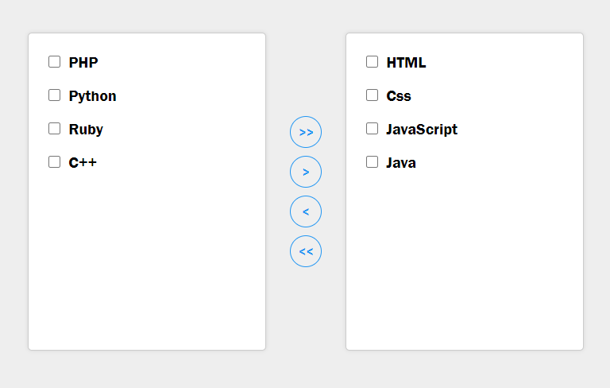

<h1 align="center">Transfer list</h1>

Transfer list from right side to the left side and vice versa

 

<a href="https://mre-dev.github.io/transfer-list/">----- Click To View Demo -----</a>

<h2></h2>

A transfer list enables the user to move one or more list items between lists and is Fully responsive for use on desktop or mobile.

<h2></h2>

Screenshot : 

